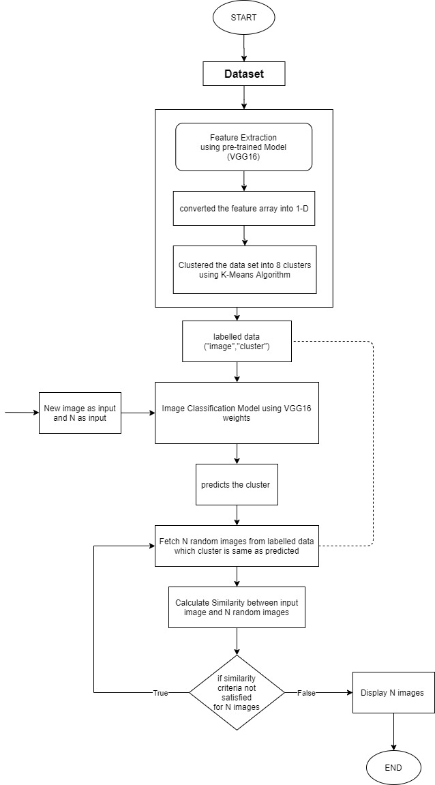

# Avantari Machine Learning assignment
## Problem Statement
### You are provided with a dataset of ~5k 512x512 images, your program should accept an 512x512 input image and return N images from the provided dataset similar to the input image.
## Here's is my approach

## How to Execute ?
### Fork the repository and all you need to do is open the "predicting-similar-for-input-step3.ipynb" notebook and change the paths of dataset,labelled-data and model. Ready to go !! Execute the cells one by one and it promts to enter the input image and how many similar images you want to display. By giving these as inputs you'll get the most simialar n images from our dataset!!

## Here are some outputs

<table><tr><td></td><td></td></tr></table>

##### Made with ❤ by [naveenjoshi](https://naveenjoshi.glitch.me)
